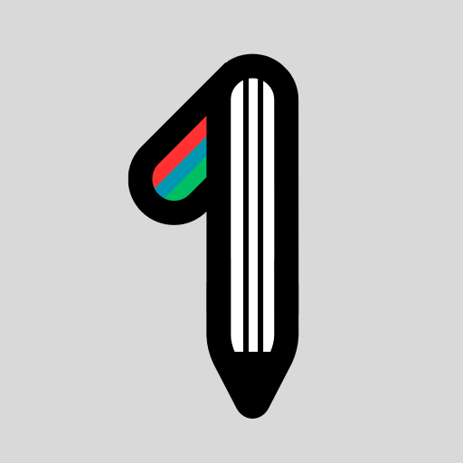
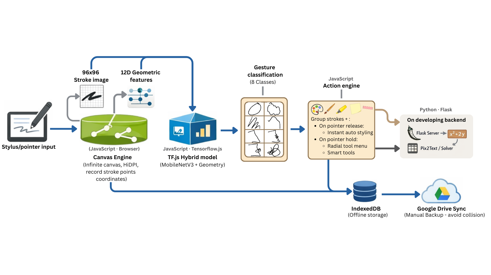
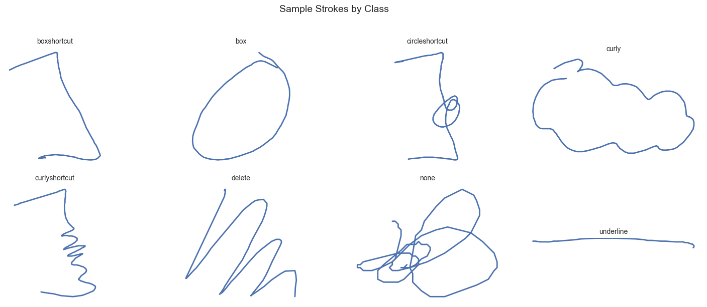

<p align="center">
  
</p>

<h1 align="center">OnePen</h1>

<p align="center">
  <strong>AI-Powered Gesture Recognition for Frictionless Handwritten Note-Taking</strong>
</p>

<p align="center">
  
  
  
  
  
</p>

---
## TL;DR 

**OnePen** is an AI-powered, in-browser handwritten note-taking app that replaces toolbar-based formatting with real-time gesture recognition.

I designed and deployed a **hybrid machine learning model** that classifies handwritten gestures (box, underline, delete, brackets, etc.) using **both visual and geometric stroke features**, achieving **99.89% accuracy** with **~20 ms inference time** directly in the browser.

### Why it’s interesting
- End-to-end ML system: data collection → feature engineering → model training → TF.js deployment
- Hybrid architecture (CNN (MobileNetV3) + 12 handcrafted geometry features) to resolve real UX ambiguity cases
- Optimized for real-world constraints: latency, model size, offline-first PWA usage
- Direct user-facing impact: ML decisions drive a smoother creative workflow

### Technical highlights
- **Model**: MobileNetV3 + Squeeze-and-Excitation + 12D geometric features
- **Performance**: 99.89% accuracy · 2.5 MB model · ~20 ms inference
- **Deployment**: Fully client-side with TensorFlow.js (no server dependency)
- **ML Ops**: MLflow experiment tracking with reproducible pipelines

### Stack
**TensorFlow / Keras · TensorFlow.js · Python · MLflow · Canvas API · PWA**


## 🚨 The Problem

Handwritten note-taking is full of interruptions.  
Changing colors, highlighting, erasing, or switching pens forces you to lift your hand, reach for a toolbar, then return to the page.

These tiny actions add up—quietly breaking your flow and focus.

---

## ✨ The Solution

**OnePen** removes that friction.

It’s a handwriting-first note-taking web app powered by **AI gesture recognition**, allowing you to write, format, and organize naturally—without ever touching a toolbar.

- Circle content → **Highlight**
- Underline text → **Bold or Title**
- Draw brackets → **Change stroke color**

**One pen. Zero interruptions.**

🎥 **[Watch Demo →](https://github.com/user-attachments/assets/841e0054-ee6b-4bc9-9c63-4c769e01642b)**

---

## 🚀 Key Features

### ✍️ Gesture Recognition (ML-Powered)

**Quick Draw** — Instantly styles strokes (fully customizable):

| Gesture | Action |
|-------|--------|
| Box | Groups and styles enclosed content |
| Wavy box | Groups content with alternative styling |
| Strike-through | Deletes crossed strokes |
| Box / Curly / Circle brackets | Styles child content within bracket height |

**Draw + Hold** — Opens a radial tool dial  
> 6 gestures × 8 tools = **48 quick-access tools**

Draw any gesture (except delete), hold briefly, and select a tool—without lifting your pen.

---

### 📚 Study Tools
- **Tape Flashcards** — Mask content with decorative tape (6 styles). Click to reveal.
- **Auto-Summaries** — Generate study sheets from titles, boxes, and highlights.
- **Table of Contents** — Auto-generated from headings for instant navigation.

---

### 🧠 Smart Notes
- **Sticky Notes** — Attach floating notes with mini drawing canvases.
- **Hyperlinks** — Draw regions to create clickable links.
- **Math Solver** — Handwritten equations → LaTeX → solved (via Pix2Text).

---

### 📦 Media & Export
- Insert **images / PDFs** with resize, rotate, and opacity controls
- **Google Drive sync** with auto-backup every 15 seconds
- **Offline-first PWA** — Works without internet after first load
- Share notebooks as portable **JSON files**

---

## 🧩 Technical Overview

### System Architecture


---

### Model Architecture

OnePen uses a **hybrid dual-input model** that fuses visual and geometric stroke features:

```
┌─────────────────┐     ┌─────────────────┐
│  96×96 Image    │     │  12D Geometric  │
│    (stroke)     │     │    Features     │
└────────┬────────┘     └────────┬────────┘
         │                       │
         ▼                       ▼
┌─────────────────┐     ┌─────────────────┐
│  MobileNetV3    │     │   Dense 128→64  │
│  + SE Attention │     │  + LayerNorm    │
└────────┬────────┘     └────────┬────────┘
         │                       │
         └──────────┬────────────┘
                    ▼
           ┌───────────────┐
           │    Concat     │
           │   384 → 192   │
           │   + Dropout   │
           └───────┬───────┘
                   ▼
           ┌───────────────┐
           │   8 Classes   │
           │   (softmax)   │
           └───────────────┘
```

**Why hybrid?**  
Image-only models struggled with visually similar gestures (box vs bracket, underline vs delete).  
Adding geometric features improved accuracy by **~5–8%**.

---

### The 12 Geometric Features

| # | Feature | Why It Helps |
|---|--------|--------------|
| 1 | Closure ratio | Boxes form closed loops |
| 2 | Compactness | Underlines are elongated |
| 3 | Spread ratio | Underlines have low spread |
| 4 | Aspect ratio | Distinguishes wide vs tall |
| 5 | Edge fraction | Boxes cluster on edges |
| 6 | Point count | Deletes use more points |
| 7 | Height diff | Underlines stay below threshold |
| 8 | Horizontal variance | Underlines vary in X |
| 9 | Total path length | Wavy strokes are longer |
| 10 | Perimeter ratio | Size-invariant metric |
| 11 | Spine verticality | Deletes are diagonal |
| 12 | Vertical variance | Underlines have low Y variance |

---

### Model Performance

| Model | Accuracy | Size | Inference |
|------|---------|------|----------|
| MobileNetV3-Large | 99.88% | 5 MB | 30 ms |
| **MobileNetV3-Small (Chosen)** | **99.89%** | **2.5 MB** | **20 ms** |
| EfficientNetV2-B0 | — | 7 MB | 60 ms |

Chosen for **near-perfect accuracy** with **ultra-fast browser inference**.

---

### Data Pipeline
1. Custom data collection app (4 writers, varied styles)
2. Augmentation: rotation, shear, scale, flip (6× data)
3. Preprocessing: normalization, 96×96 rendering, feature extraction
4. Full experiment tracking with **MLflow**



> Runs entirely **in-browser**. Optional Flask backend for math solving.

---

## ⚡ Quick Start

```bash
git clone https://github.com/yourusername/OnePen.git
cd OnePen

python -m venv .venv
source .venv/bin/activate  # Windows: .venv\Scripts\activate
pip install -r requirements.txt

cd app
python -m http.server 8000

### Train Your Own Model

```bash
make dataset   # Preprocess collected data
make train     # Train hybrid CNN (~200 epochs)
make export    # Export to TensorFlow.js
```

---

## Project Structure

```
OnePen/
├── app/                      # Progressive Web App
│   ├── index.html           # Main interface
│   ├── draw.js              # Canvas engine (zoom, pan, stylus)
│   ├── predict.js           # TensorFlow.js inference
│   ├── sw.js                # Service worker (offline)
│   └── manifest.json        # PWA manifest
│
├── src/modifiers/           # ML Library
│   ├── models/
│   │   └── architecture.py  # Hybrid CNN definition
│   ├── features/
│   │   └── geometric.py     # 12D feature extraction
│   └── data/
│       ├── loader.py        # Dataset loading
│       └── augmenter.py     # Data augmentation
│
├── scripts/                 # CLI Tools
│   ├── train.py            # Training script
│   └── export.py           # TF.js export
│
├── config/config.yaml       # Hyperparameters
└── mlruns/                  # MLflow experiments
```

---

## Tech Stack

| Layer | Technologies |
|-------|-------------|
| **Frontend** | Canvas API, TensorFlow.js, IndexedDB, Service Workers |
| **ML** | TensorFlow/Keras, MobileNetV3, Squeeze-and-Excitation |
| **Backend** | Flask, Pix2Text (math), Google Drive API |
| **DevOps** | MLflow, pytest, ruff, mypy |

---

## What I Learned

- **Feature engineering matters** — Hand-crafted geometric features outperformed adding more CNN layers; however, not all features help, adding them even make the model worse.
- **Augmentation** - Augmentation is very helpful, generating many more realistic data samples without manually collecting data. However, it is needed to be handled carefully or it would break the characteristics of the unique classes.
- **Hybrid models** — Combining different input modalities (image + vector) requires careful normalization 
- **Browser ML constraints** — Model size and inference speed directly impact UX; MobileNet's efficiency was key
- **Data diversity** — Collecting from multiple handwriting styles prevented overfitting to my own gestures

---

## License

MIT

---

## Author

**Andy Huynh** — [GitHub](https://github.com/AndyHuynh24)

