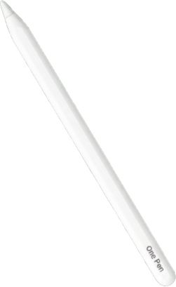

<p align="center">
  
</p>

<h1 align="center">OnePen</h1>

<p align="center">
  <strong>AI-Powered Handwriting Recognition for Smart Note-Taking</strong>
</p>

<p align="center">
  
  
  
  
  
</p>

---

## What is OnePen?

Every time we switch tools while taking notes—underline, highlight, draw a box, delete—our creative flow breaks. Those micro-interruptions add up.

**OnePen** is a web-based note-taking app that uses machine learning to recognize handwriting gestures in real-time. Draw a box around text to highlight it. Strike through to delete. Circle to select. No toolbar needed.

[**Watch the Demo →**](https://github.com/user-attachments/assets/841e0054-ee6b-4bc9-9c63-4c769e01642b)

---

## Features

**Gesture Recognition**
- Recognizes underlines, boxes, curly brackets, strike-throughs
- Auto-shape detection (turns sketchy circles into perfect ones)
- Quick tool selection via circle gestures

**Smart Notes**
- Hidden sticky notes attached to any text
- Handwritten strokes as clickable links
- Math recognition via Pix2Text
- Auto-generated table of contents from titles
- Smart summarizer for study sheets

**Sync & Storage**
- Auto-saves locally with IndexedDB
- Google Drive sync

---

## Architecture

The app runs entirely in the browser with a lightweight Flask backend for math solving.

```
Frontend (Browser)
├── Canvas drawing engine (zoom, pan, stylus support)
├── TensorFlow.js model (~5MB)
└── IndexedDB + Google Drive sync

Backend (Flask)
├── Pix2Text for math recognition
└── Google Drive API
```

### ML Model

I built a hybrid CNN that combines:
1. **Image input** (136×136 stroke images) → MobileNetV3 backbone
2. **Geometric features** (10D vector) → Dense layers
3. **Fusion layer** → Concatenate + classify

This hybrid approach improved accuracy by ~5-8% compared to image-only models.

**Classes recognized:**
- `underline`, `box`, `curly`, `delete`
- `boxshortcut`, `curlyshortcut`, `circleshortcut`
- `none` (regular writing)

---

## How I Built It

### Data Collection

Collected stroke data from 4 contributors with different handwriting styles. Each person recorded samples across all gesture types to ensure the model generalizes well.

<!-- TODO: Add sample counts per contributor -->

See the EDA notebook: [00_exploratory_data_analysis.ipynb](notebook_experiments/00_exploratory_data_analysis.ipynb)

<!-- TODO: Add class distribution chart -->
<!--  -->

### Preprocessing

Each stroke goes through:
1. Normalization to [0,1] bounding box
2. Rendering to 136×136 grayscale image
3. 10D geometric feature extraction

I also applied data augmentation (rotation ±6°, shear, scale, horizontal flip) to 6x the training data.

<!-- TODO: Add augmentation examples -->
<!--  -->

### Feature Engineering

The 10 geometric features I designed:

| Feature | Why it helps |
|---------|--------------|
| Closure ratio | Circles = high closure |
| Compactness | Path length vs bounding box |
| Aspect ratio | Underlines are wide |
| Height diff | Normalized stroke height |
| Edge fraction | Where points cluster |

Adding these features alongside the image input gave a solid accuracy boost.

<!-- TODO: Add feature importance chart -->
<!--  -->

### Model Selection

I tested a few backbones:

| Model | Accuracy | Size | Speed |
|-------|----------|------|-------|
| MobileNetV3-Large | ~95% | 5 MB | 40ms |
| MobileNetV3-Small | ~93% | 2.5 MB | 25ms |
| EfficientNetV2-B0 | ~94% | 7 MB | 60ms |
| Custom CNN | ~90% | 1 MB | 15ms |

Went with MobileNetV3-Large since size wasn't a major constraint and the accuracy was best.

See comparison: [02_model_comparison.ipynb](notebook_experiments/02_model_comparison.ipynb)

<!-- TODO: Add model comparison chart -->
<!--  -->

### Training

Key settings:
- Learning rate: 0.0002
- Batch size: 32
- Early stopping: patience 35
- Used class weights to handle imbalance

<!-- TODO: Add training curves -->
<!--  -->

### Evaluation

<!-- TODO: Fill in actual metrics -->
- Test accuracy: ~XX%
- F1 score: ~XX

<!-- TODO: Add confusion matrix -->
<!--  -->

### Experiment Tracking

All runs logged with MLflow—hyperparameters, metrics, model artifacts. Makes it easy to compare experiments and reproduce results.

```bash
mlflow ui --backend-store-uri mlruns
```

<!-- TODO: Add MLflow screenshot -->
<!--  -->

### Export

Final model exported to TensorFlow.js for browser inference:

```bash
make export
```

---

## Getting Started

### Prerequisites

- Python 3.10+
- Modern browser with Canvas support

### Setup

```bash
git clone https://github.com/yourusername/OnePen.git
cd OnePen

# Create virtual environment
python -m venv .venv
.venv\Scripts\activate  # Windows
source .venv/bin/activate  # macOS/Linux

# Install dependencies
pip install -r requirements.txt

# Run the app
python app/server.py
# Then open app/index.html in your browser
```

### Training

```bash
make dataset   # Preprocess data
make train     # Train model
make export    # Export to TensorFlow.js
```

---

## Project Structure

```
OnePen/
├── app/                    # Web app
│   ├── index.html
│   ├── draw.js            # Canvas engine
│   ├── predict.js         # TF.js inference
│   └── server.py          # Flask backend
│
├── src/modifiers/         # ML library
│   ├── models/            # Model architecture
│   ├── features/          # Feature extraction
│   └── data/              # Data loading
│
├── scripts/               # CLI tools
│   ├── dataset.py
│   ├── train.py
│   └── export.py
│
├── notebook_experiments/  # Jupyter notebooks
├── config/config.yaml     # Training config
└── Makefile              # Build automation
```

---

## Tech Stack

- **Frontend:** Canvas API, TensorFlow.js, IndexedDB
- **Backend:** Flask, Pix2Text, Google Drive API
- **ML:** TensorFlow/Keras, MobileNetV3, MLflow, scikit-learn

---

## Contributing

PRs welcome! Feel free to open issues for bugs or feature requests.

---

## License

MIT

---

## Author

**Andy Huynh**
