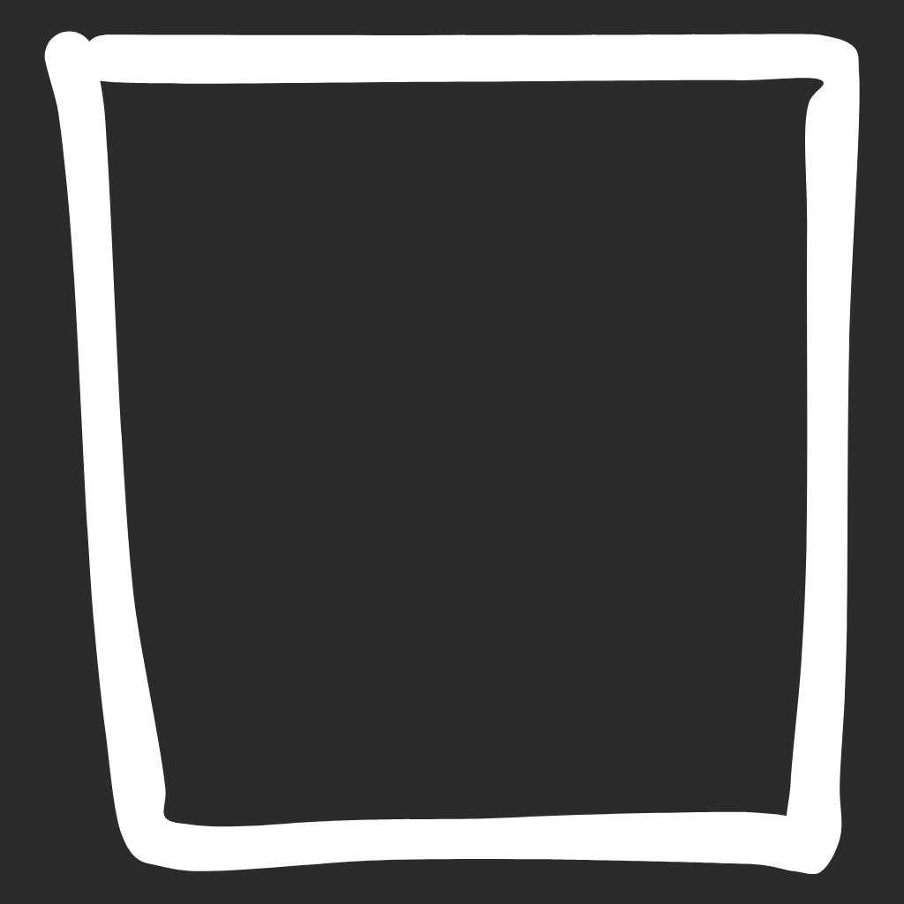
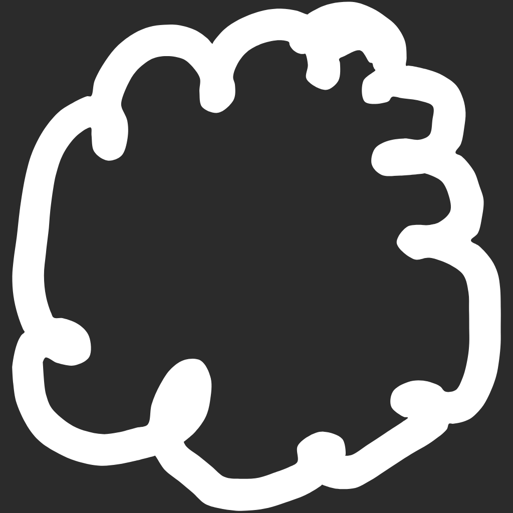
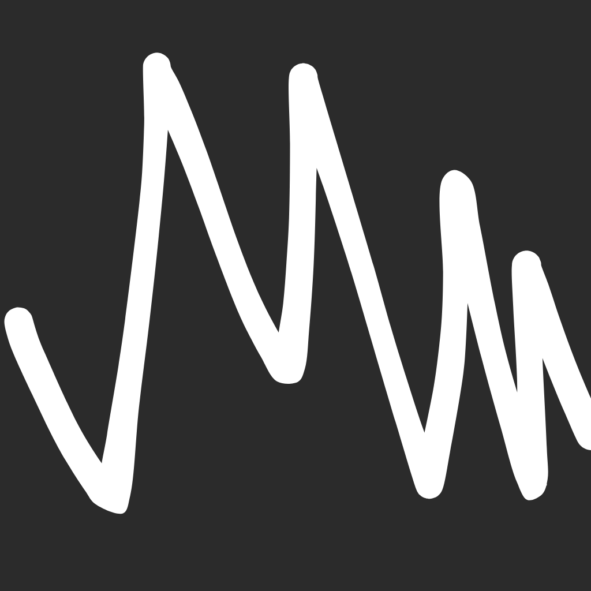
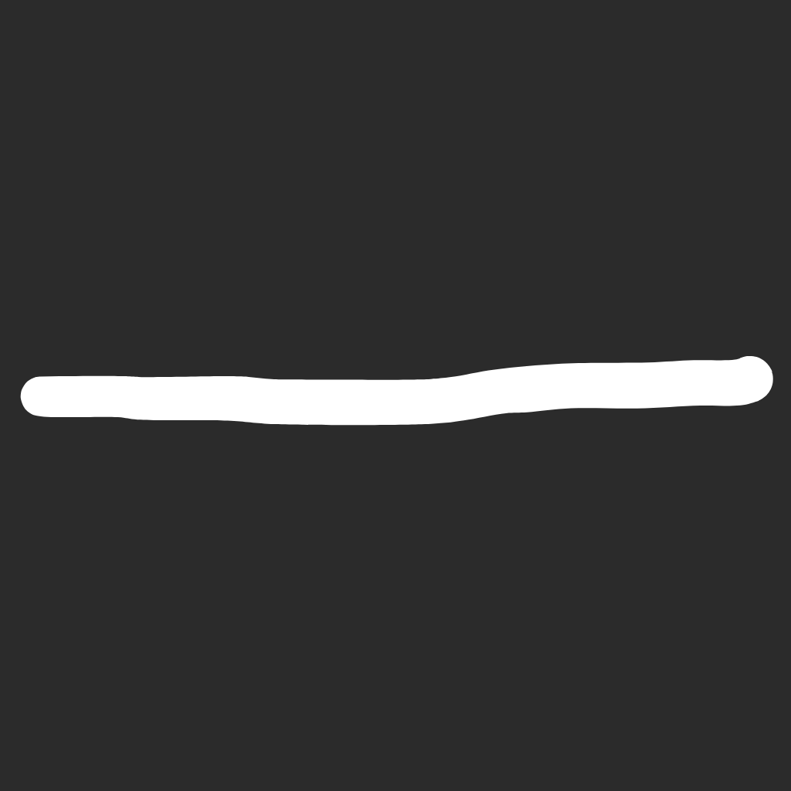
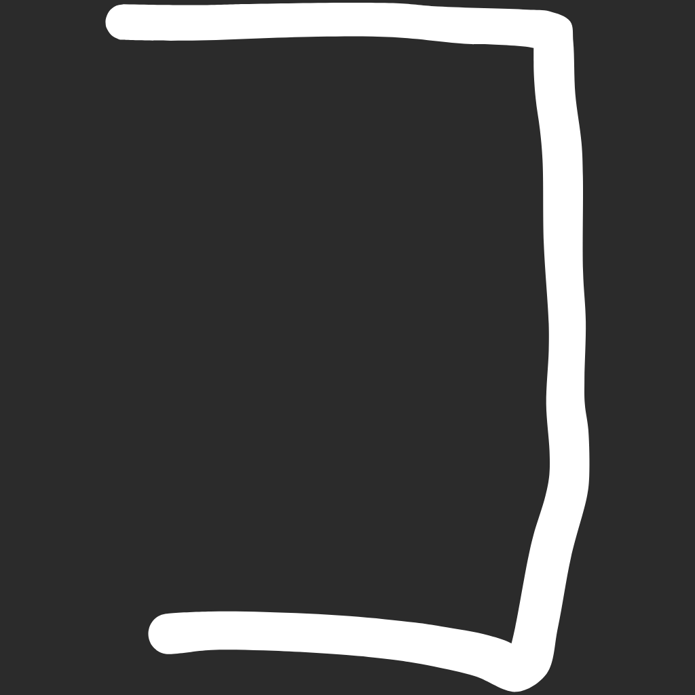
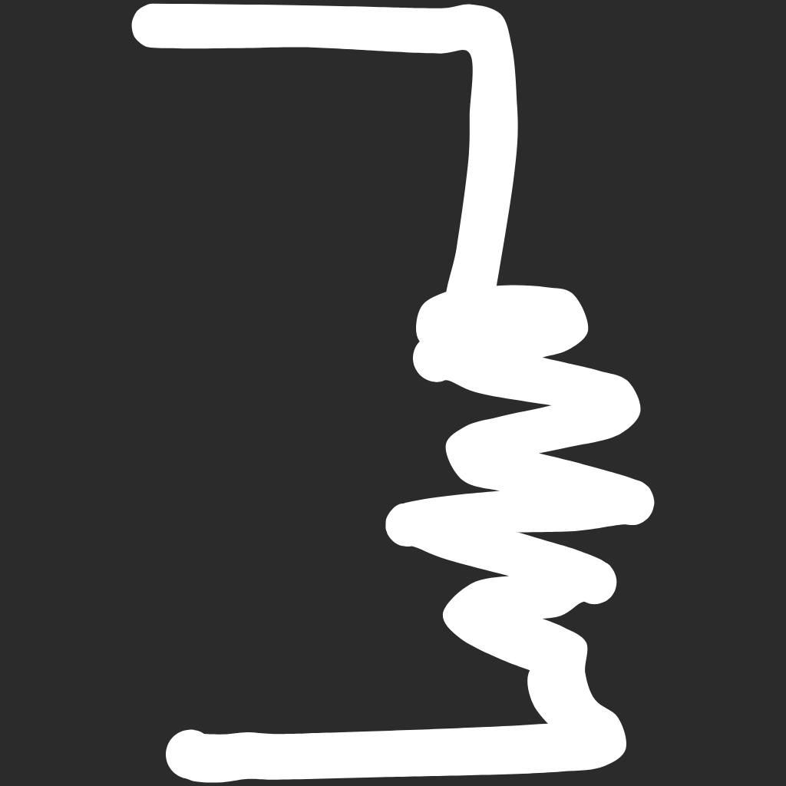
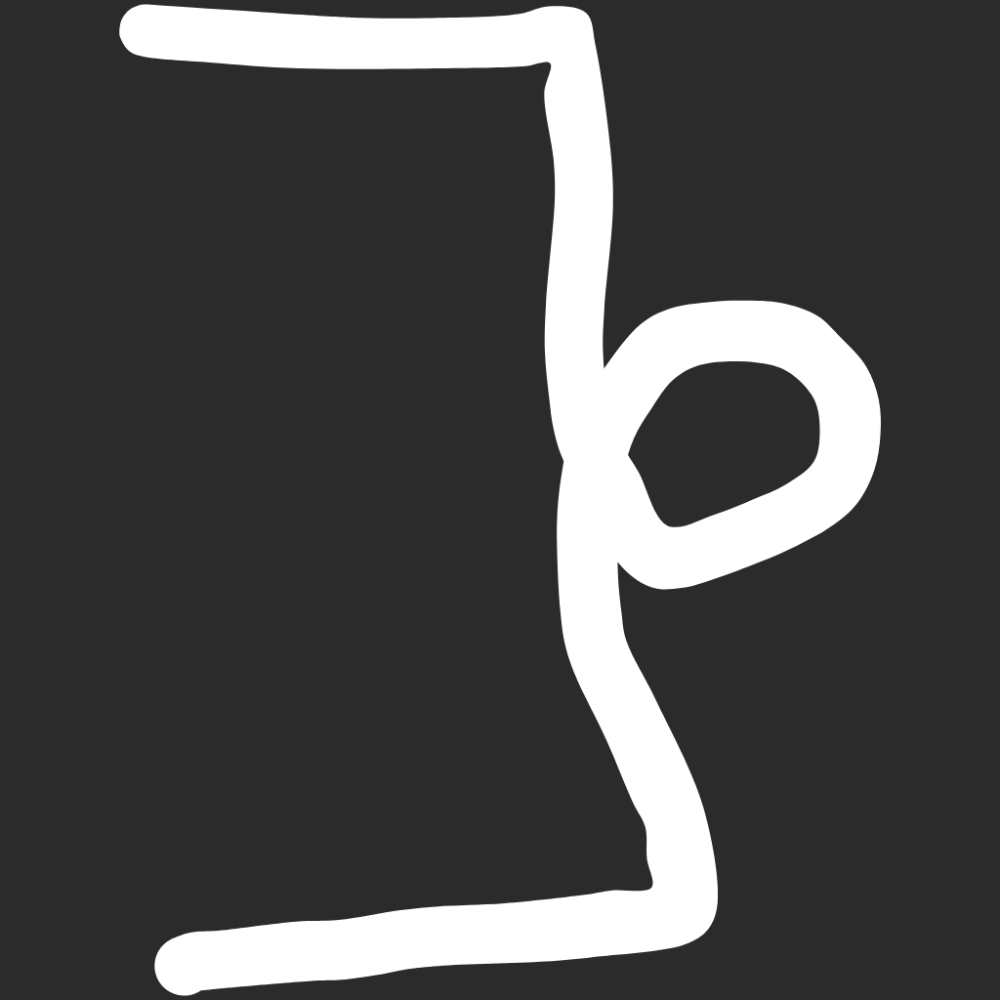

<p align="center">
  
</p>

<h1 align="center">OnePen</h1>

<p align="center">
  <b>AI-Powered Handwriting App with Real-Time Gesture Recognition</b>
</p>

<p align="center">
  <a href="#demo">Demo</a> •
  <a href="#features">Features</a> •
  <a href="#project-structure">Structure</a> •
  <a href="#architecture">Architecture</a> •
  <a href="#getting-started">Get Started</a>
</p>

<p align="center">
  
  
  
  
  
</p>

<p align="center">
  
  
  
  
</p>

---

## The Problem

Handwritten note-taking apps force constant interruptions—switching tools, tapping buttons, navigating menus. Each micro-interaction breaks focus and slows you down.

## The Solution

**OnePen** eliminates toolbar dependency through real-time gesture recognition. Draw naturally, and ML interprets your intent—grouping content, applying styles, or triggering app features instantly.

<p align="center">
  
  
  
  
  
  
  
</p>

<p align="center"><i>6 gesture modifiers recognized in real-time → instant formatting & actions</i></p>

**One pen. Zero interruptions. ~30% faster note-taking.**

---

## Demo

https://github.com/user-attachments/assets/a4335d94-51ff-4345-89c7-b58fddd72268

> **[Try Live App →](https://onepen-notes.web.app)** · Works offline after first load

---

## Project Structure

```
OnePen/
├── app/                        # Progressive Web App (Frontend)
│   ├── index.html             # Main interface
│   ├── main.js                # Core app logic & gesture handling
│   ├── draw.js                # Canvas rendering engine
│   ├── predict.js             # TensorFlow.js inference
│   ├── saveNote.js            # IndexedDB persistence
│   ├── signin.js              # Google Drive authentication
│   ├── feedbackCollector.js   # Implicit feedback for data flywheel
│   ├── config.js              # App configuration
│   ├── sw.js                  # Service worker (offline support)
│   ├── tfjs/                  # Deployed TF.js model
│   └── icons/                 # PWA icons
│
├── src/modifiers/             # ML Training Pipeline
│   ├── models/
│   │   ├── architecture.py    # Hybrid CNN + geometric model
│   │   └── trainer.py         # Training loop with callbacks
│   ├── features/
│   │   └── geometric.py       # 12D feature extraction
│   ├── data/
│   │   ├── loader.py          # Dataset loading
│   │   ├── augmenter.py       # Data augmentation
│   │   └── preprocessor.py    # Image preprocessing
│   └── utils/                 # Logging, config utilities
│
├── scripts/                   # CLI Tools
│   ├── train.py              # Training with W&B tracking
│   ├── export.py             # TF.js model conversion
│   └── dataset.py            # Data preprocessing pipeline
│
├── data/
│   ├── raw/                  # Raw stroke data by contributor
│   └── processed/            # Preprocessed training data
│
├── models/tfjs/              # Exported browser-ready model
├── config/                   # Training hyperparameters (YAML)
├── tests/                    # pytest test suite
└── assets/                   # Documentation images
```

---

## Features

<table>
<tr>
<td width="50%">

### Gesture Recognition
- **7 gesture types** recognized in real-time
- **Draw + Hold** opens radial tool menu
- 1 delete gestures + 6 raw auto-style getures + 6 gestures + hold x 8 tools = **55 quick actions**
- Fully customizable gesture-to-action mapping

</td>
<td width="50%">

### Study Tools
- **Tape Flashcards** — Cover keywords with decorative tape for active recall; tap to reveal. Each tape becomes a reviewable flashcard.
- **Auto-Summaries** — Generate study sheets from highlights
- **Table of Contents** — Auto-built from headings
- **Reminders** — Time-based notifications

</td>
</tr>
<tr>
<td width="50%">

### Smart Notes
- **Sticky Notes** — Floating annotations with mini canvas
- **Embed Links** — Clickable web previews
- **Math Solver** — Handwritten → LaTeX → solved

</td>
<td width="50%">

### Export & Sync
- **Google Drive** auto-backup
- **PDF Export** with full fidelity
- **Offline-first** PWA architecture
- **Cross-device** via portable JSON

</td>
</tr>
</table>

---

## Architecture

### System Overview

<p align="center">
  
</p>

### Model Architecture

**Hybrid CNN + Geometric Features** — Combining visual and numerical inputs for robust gesture classification.

```
        Image Input (96×96)              Geometric Features (12D)
              │                                   │
              ▼                                   ▼
    ┌───────────────────┐               ┌─────────────────┐
    │   MobileNetV3     │               │   Dense 128→64  │
    │  + SE Attention   │               │  + LayerNorm    │
    └─────────┬─────────┘               └────────┬────────┘
              │                                   │
              └──────────────┬────────────────────┘
                             ▼
                    ┌─────────────────┐
                    │  Fusion Layer   │
                    │   384 → 192     │
                    └────────┬────────┘
                             ▼
                    ┌─────────────────┐
                    │   8 Classes     │
                    │   (softmax)     │
                    └─────────────────┘
```

<p align="center">
  
</p>

**Why hybrid?** Image-only models confused similar gestures (box vs bracket). Adding geometric features improved accuracy by **5-8%**.

### Geometric Features

| Feature | Purpose |
|---------|---------|
| Closure ratio | Detects closed loops (boxes) |
| Aspect ratio | Distinguishes wide vs tall strokes |
| Path length | Identifies wavy/complex strokes |
| Verticality | Separates diagonal deletes from horizontal underlines |
| Point density | Distinguishes quick strokes from deliberate ones |
| + 7 more | Fine-grained disambiguation |

### Performance

| Metric | Value |
|--------|-------|
| **Accuracy** | 99.89% |
| **Inference** | ~20ms |
| **Model Size** | 2.5 MB |
| **Classes** | 8 gesture types |

---

## Getting Started

### Prerequisites

- Python 3.10+
- Node.js (optional, for dev server)

### Installation

```bash
# Clone repository
git clone https://github.com/AndyHuynh24/OnePen.git
cd OnePen

# Setup Python environment
python -m venv .venv
source .venv/bin/activate  # Windows: .venv\Scripts\activate
pip install -r requirements.txt

# Run the app
cd app && python -m http.server 8000
# Open http://localhost:8000
```

### Train Your Own Model

```bash
# Preprocess data
python scripts/dataset.py

# Train (with W&B tracking)
python scripts/train.py --epochs 200 --backbone mobilenetv3_small

# Export to TensorFlow.js
python scripts/export.py --model outputs/run_*/stroke_classifier.keras --quantize uint16
```

---

## Tech Stack

| Layer | Technologies |
|-------|--------------|
| **Frontend** | JavaScript, HTML5 Canvas API, TensorFlow.js, IndexedDB, Web Workers |
| **ML/AI** | TensorFlow, Keras, MobileNetV3, Squeeze-and-Excitation Networks, Weights & Biases |
| **Infrastructure** | Progressive Web App (PWA), Service Workers, Firebase Hosting, Google Drive API |
| **Quality** | pytest, ruff, mypy, GitHub Actions CI/CD |

---

## Key Learnings (This Project)

- **Feature engineering > more layers** — Hand-crafted geometric features outperformed deeper CNNs for this use case
- **Augmentation requires care** — Aggressive transforms broke class-specific characteristics
- **Browser constraints shape design** — Model size directly impacts UX; MobileNet's efficiency was essential
- **Diverse training data prevents overfitting** — Collecting from multiple handwriting styles was critical

---

## License

MIT

---

<p align="center">
  Built by <a href="https://github.com/AndyHuynh24">Andy Huynh</a>
</p>
