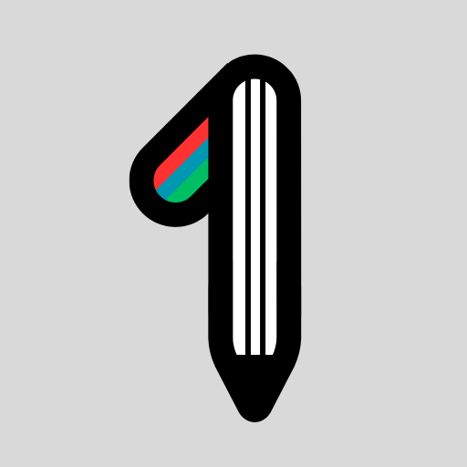
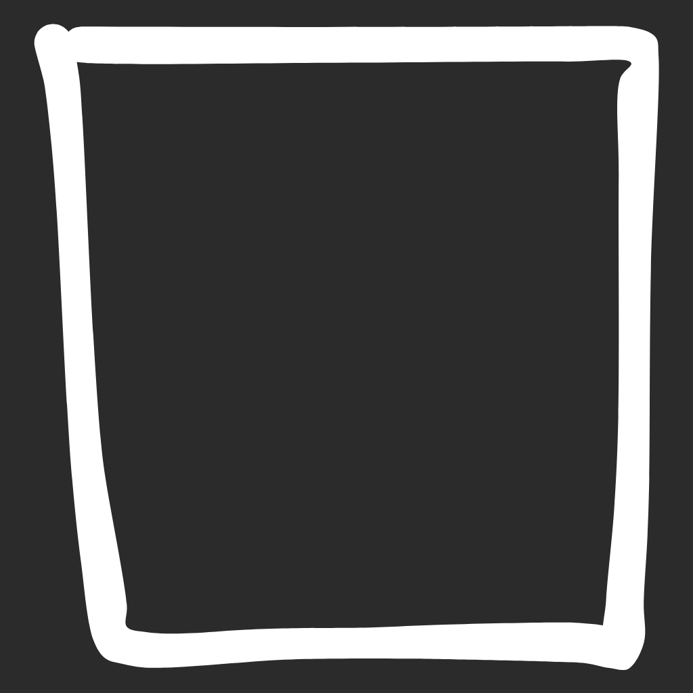
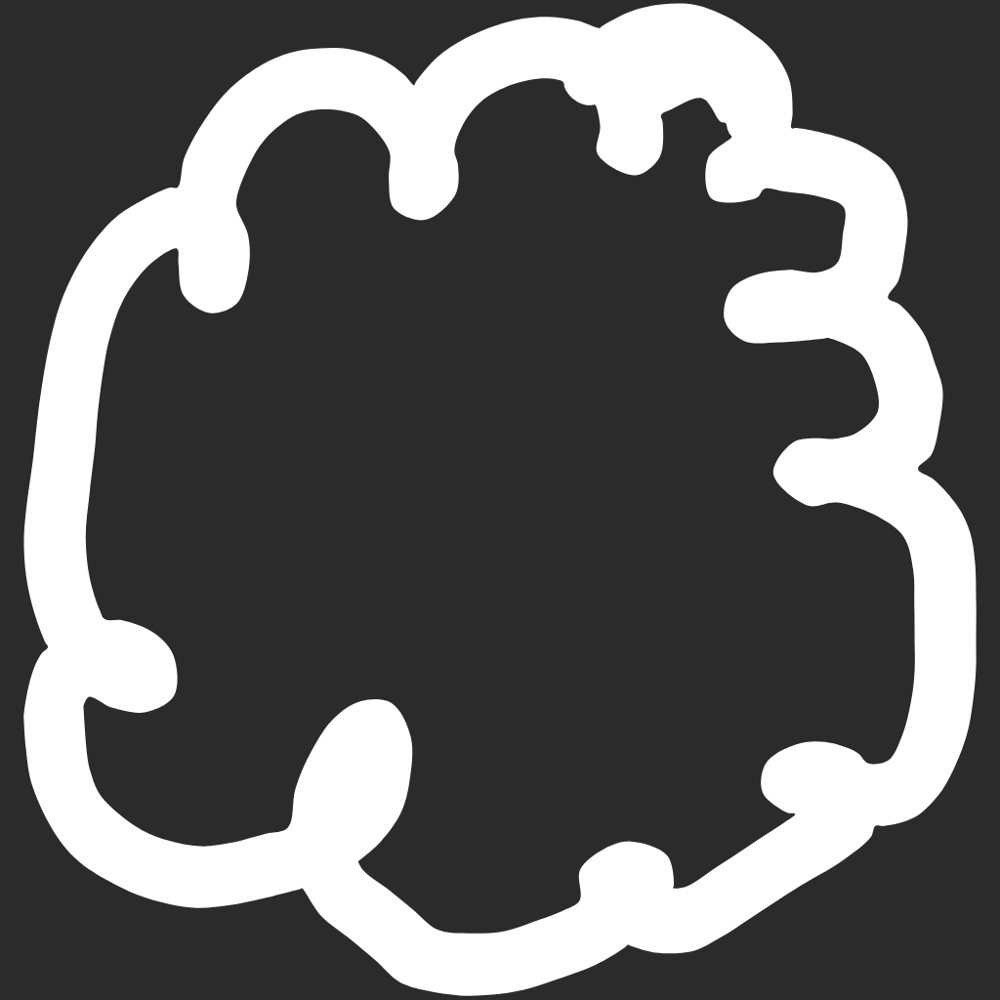
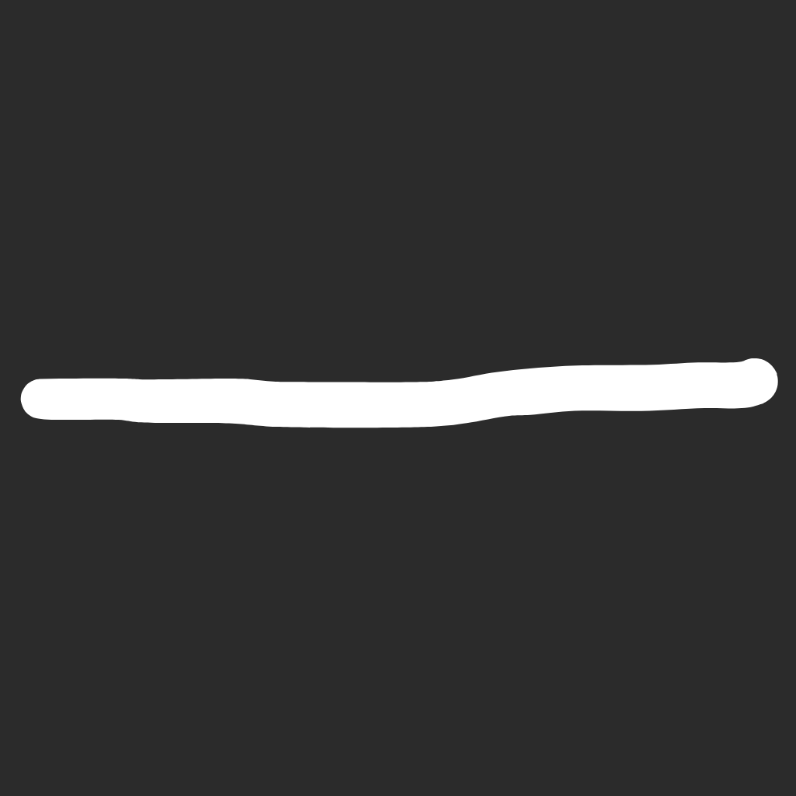
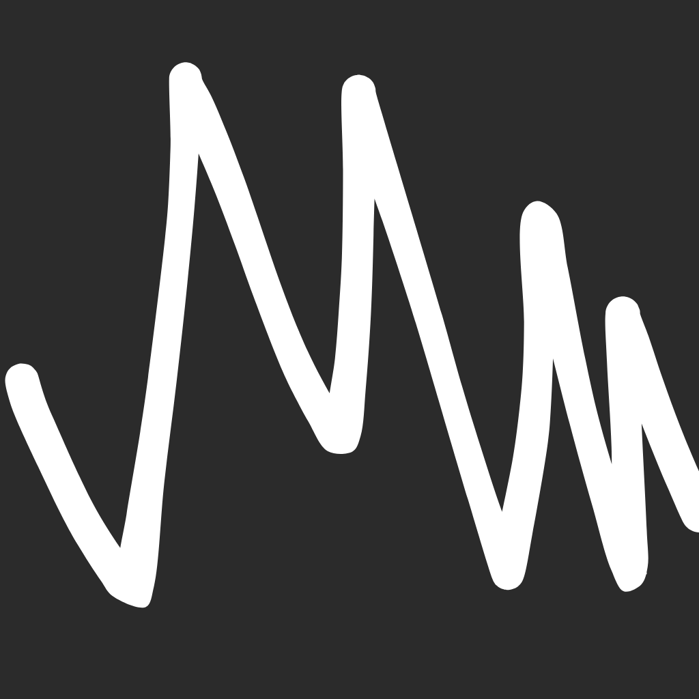
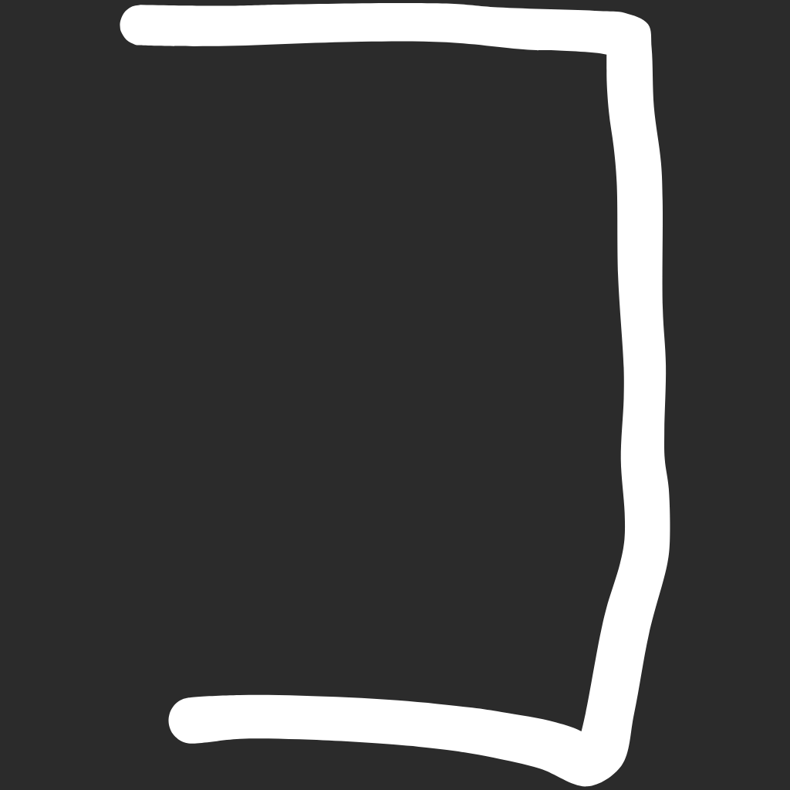
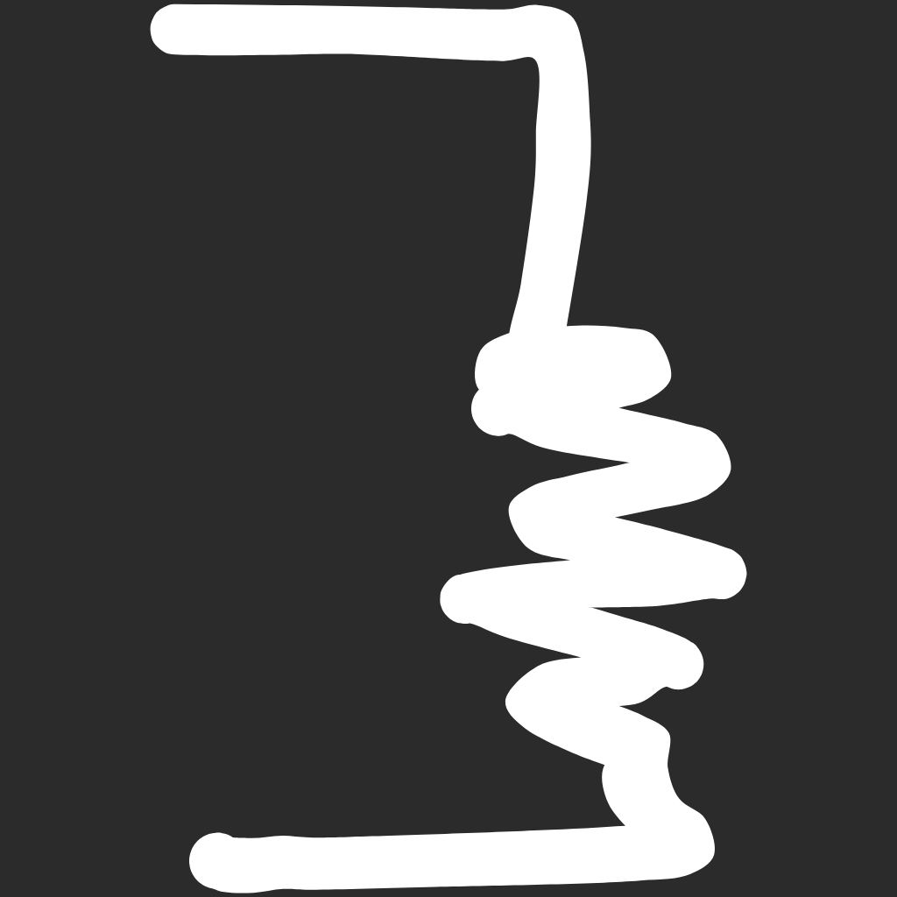
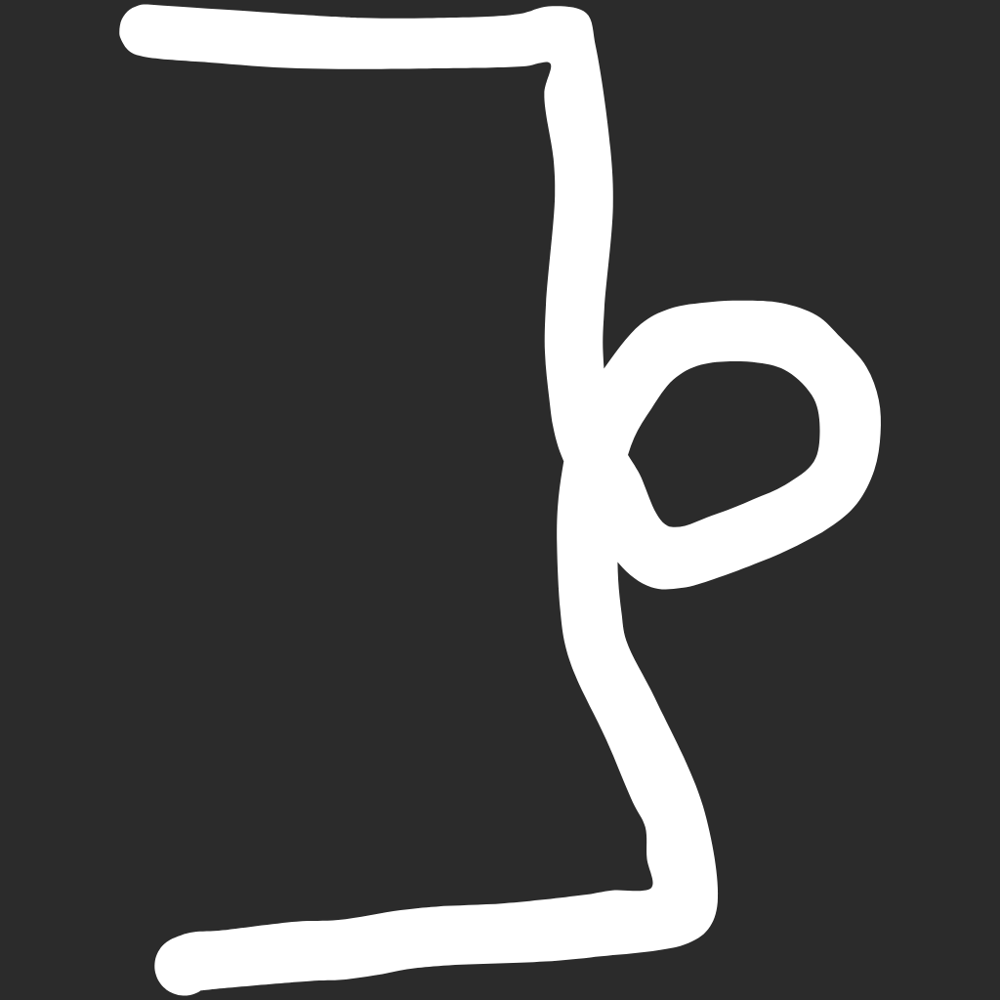

<p align="center">
  
</p>

<h1 align="center">OnePen</h1>

<p align="center">
  Handwriting notes where the pen strokes you draw are also the commands.<br/>
  <a href="https://onepen-notes.web.app">onepen-notes.web.app</a> · Most Novel AI, HackUMass XII
</p>

---

Most note apps make you stop writing to pick a tool. In OnePen you draw a box
around some ink, underline it, bracket it or scribble over it, and a small model
in the browser recognizes the shape and acts on it: recolor, delete, make it a
heading, cover it with flashcard tape, attach a link, set a reminder, solve an
equation.

<p align="center">
  
  
  
  
  
  
  
</p>

Demo: https://github.com/user-attachments/assets/a4335d94-51ff-4345-89c7-b58fddd72268

## How it works

- Draw a box, curly brace or bracket around ink and it's restyled with that
  gesture's color and size. Scribble over ink to delete it.
- Draw a gesture and hold the pen still: a radial menu opens with tools for
  what you selected (pen colors, H1–H3 headings, highlight, bold, move,
  copy/paste, tape, sticky note, link, reminder, math). Slide to a tool and lift.
  Holding on empty space gives quick tools (pen, highlighter, eraser, paste, …).
  Every menu is editable in Settings.
- Tape hides part of a boxed group. The flashcard view turns each one into a
  card: the rest of the group is the question, the taped part is the answer.
- Headings feed a table of contents; reminders show up in a panel across all
  notebooks.
- Typed text, images and PDFs can sit on the page too. Export to PNG or PDF.
- Notes live in IndexedDB and the app works offline. Signing in with Google
  lets you back up to and restore from Drive.

## Repo

```
app-v2/         the app: Vite + TypeScript + Svelte 5 PWA (see app-v2/README.md)
math-server/    Pix2Text + SymPy service behind the math tool
trainer/        gesture model training and TF.js export
data/raw_jsonl/ stroke dataset, one file per contributor
Dockerfile      GPU training image (used with akash_train.py)
app/            the original v1, kept for reference
```

## Run it

```bash
cd app-v2
npm install
npm run dev
```

The dev server is exposed on the LAN, so a tablet can open it at your machine's
IP. The math tool also needs `math-server/` running on port 8000.

## The model

One stroke goes in and comes out as one of eight labels: underline, box, curly,
delete, square/wavy/circle bracket, or none. The input is the stroke rendered at
96×96 plus 12 geometric features (how closed the shape is, aspect ratio, path
length, verticality and so on). A MobileNetV3-Small branch reads the image, a
small dense branch reads the features, and the two are merged before the
softmax. The features are there because the image alone kept mixing up boxes and
brackets.

It runs with TensorFlow.js in a Web Worker so it never blocks the pen. A stroke
only goes to the model if it's big enough and encloses or crosses existing ink,
so ordinary writing doesn't trigger it.

Training, the architecture comparison and exporting a new model to the app are
covered in [trainer/README.md](trainer/README.md):

```bash
cd trainer
pip install -r requirements.txt
python train.py --model hybrid --finetune --app-tfjs-dir ../app-v2/public/tfjs
```

## License

MIT. Built by [Andy Huynh](https://github.com/AndyHuynh24).
